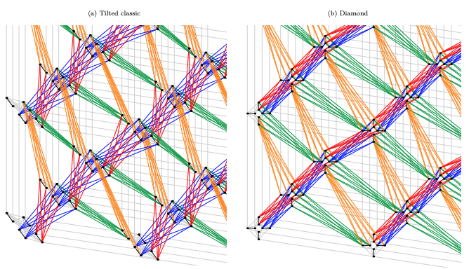

# BQM

### Pegasus Architecture (source: https://arxiv.org/pdf/1901.07636.pdf)

### References
1. [D-Wave Ocean Software Documentation](https://docs.ocean.dwavesys.com/en/latest/index.html)
2. [Pegasus: The second connectivity graph for large-scale quantum annealing hardware](https://arxiv.org/pdf/1901.07636.pdf)
3. [D-Wave System Documentation](https://docs.dwavesys.com/docs/latest/index.html)
4. [Quantum Bridge Analytics I: A Tutorial on Formulating
and Using QUBO Models](https://arxiv.org/ftp/arxiv/papers/1811/1811.11538.pdf)
5. [Dimod Documentation](https://readthedocs.com/projects/d-wave-systems-dimod/downloads/pdf/latest/)
6. [Sudoku Tutorial](https://tc3-japan.github.io/DA_tutorial/tutorial-1-sudoku.html)

